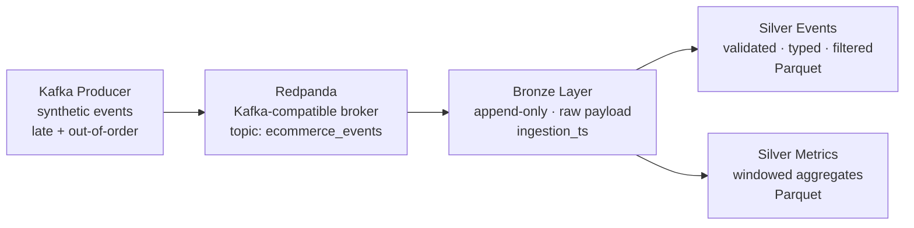

# Streaming E-commerce Lakehouse

   

Near-real-time data engineering pipeline ingesting synthetic e-commerce events from a Kafka-compatible broker (Redpanda) into a local lakehouse using Spark Structured Streaming. Implements Bronze and Silver layers with checkpoint-backed recovery, watermark-based late-event handling, and per-micro-batch observability.

The pipeline is designed around real streaming problems — late and out-of-order events, at-least-once delivery, schema validation — rather than clean tutorial data.

## Key Highlights

- Spark Structured Streaming with micro-batch processing and exactly-once checkpoint semantics
- Watermark-based handling of late and out-of-order events
- Bronze layer: append-only raw event sink with ingestion timestamp
- Silver layer: validated and typed event stream + stateful windowed metrics, both persisted to Parquet
- Per-micro-batch observability: row count, commerce share, page view count, and processing time logged per epoch
- Deterministic Silver filter: idempotent quality check so reprocessing the same batch produces the same output
- Redpanda as a local Kafka-compatible broker — no cloud dependency for development
- CI pipeline on GitHub Actions for linting and test execution

## Architecture



## Pipeline Evidence

### Silver Micro-batch Observability Log


### Redpanda Console — Topic with Incoming Messages


<details>
<summary><strong>More pipeline evidence</strong></summary>

### Local Lakehouse Structure After Pipeline Run


</details>

## Output

Two Silver outputs written to Parquet after each micro-batch:

**Silver events** — one row per validated event:

`event_id | event_type | event_ts | user_id | session_id | country | event_source | device_type | payload`

**Silver metrics** — windowed aggregates per 1-minute tumbling window:

`window | event_type | event_count`

## Stack

| Layer | Technology |
|---|---|
| Broker | Redpanda (Kafka-compatible) |
| Compute | PySpark Structured Streaming |
| Storage | Local Parquet (Bronze + Silver) |
| Checkpointing | Local filesystem |
| Orchestration | Docker Compose (Redpanda) |
| CI | GitHub Actions + pytest + ruff |

## Engineering Overview

- Micro-batch mode (`processingTime="10 seconds"`) for exactly-once semantics with checkpointing — continuous mode adds latency savings not relevant at this event volume
- Watermark bounds stateful aggregation state and handles delayed events explicitly
- Bronze is append-only: Kafka at-least-once delivery means duplicates can exist at Bronze; Silver applies a deterministic quality filter so reprocessing is safe
- Silver quality filter removes rows with null `event_id`, null `event_ts`, and null `price` for commerce event types (`add_to_cart`, `purchase`)
- Observability `foreachBatch` sink is independent of the Silver write path — logs row counts and processing time per epoch without adding latency to data writes
- Producer handles `KafkaError` per message and logs failures without stopping the stream; graceful shutdown on `KeyboardInterrupt` with flush and close
- All paths (broker, topic, output dirs, checkpoint dirs) are configured through environment variables

## Testing Strategy

| Test layer | Purpose |
|---|---|
| Unit tests — kafka_producer | Validates event structure, field types, late/out-of-order simulation |
| Unit tests — streaming_transformations | Covers Silver filter logic and windowed metrics on a local Spark session |
| Integration test — local_paths | Validates output directory setup without Kafka or Spark |

## Repository Structure

```text
src/
  producer/kafka_producer.py              # synthetic event producer
  streaming/stream_to_bronze_silver.py    # Spark Structured Streaming job
  schemas/event_schema.json               # event schema for payload parsing
docker/
  docker-compose.yml                      # Redpanda broker
sql/
  silver_metrics.sql                      # example Spark SQL for Silver metrics
tests/
  unit/test_kafka_producer.py
  unit/test_streaming_transformations.py  # Silver filter + metrics on local Spark
  integration/test_local_paths.py
.github/workflows/ci.yml
```

<details>
<summary><strong>Layer Details</strong></summary>

### Bronze

Raw Kafka payloads written append-only with ingestion metadata:

- `ingestion_ts` — wall-clock time of micro-batch processing
- `raw_value` — original JSON payload as string

Preserves full source traceability and provides a safe landing zone for schema changes.

### Silver Events

Parsed, validated, and typed stream — one row per event:

- Null `event_id` and `event_ts` filtered out
- Null `price` filtered for `add_to_cart` and `purchase` event types
- Typed `event_ts` from ISO 8601 string via `to_timestamp`
- Nested `payload` struct preserved

### Silver Metrics

Stateful windowed aggregates using a 1-minute tumbling window on `event_ts`:

- Watermark of 10 minutes bounds late-event state
- `event_type` count per window
- Output mode: `append` (complete windows only)

</details>

<details>
<summary><strong>Design Decisions and Trade-offs</strong></summary>

**Micro-batch vs continuous streaming:** Micro-batch gives exactly-once semantics with checkpointing and is easier to reason about operationally. Continuous mode adds latency savings that are not relevant at this event volume.

**Parquet instead of Delta Lake:** Delta would add schema enforcement and ACID transactions, but also a heavyweight dependency. For a Bronze/Silver MVP the goal is demonstrating the streaming logic. A migration to Delta would be configuration-only.

**At-least-once with idempotent Silver filter:** Kafka source delivers at-least-once. Duplicates are tolerated at Bronze. Silver applies a deterministic quality filter so reprocessing the same batch produces the same output.

**Separate observability sink:** The `foreachBatch` observability query is independent of the Silver write path. This means it does not add latency to data writes and can be changed or disabled without touching the data sink.

</details>

## How To Run

### 1. Start Redpanda

```bash
docker compose -f docker/docker-compose.yml up -d
```

### 2. Install dependencies

```bash
python3.11 -m venv .venv
source .venv/bin/activate
pip install -r requirements.txt
```

### 3. Run the producer

```bash
python src/producer/kafka_producer.py
```

### 4. Run the streaming job

```bash
python src/streaming/stream_to_bronze_silver.py
```

### 5. Local quality checks

```bash
pip install -r requirements-dev.txt
make lint
make test
```

### Failure recovery check

1. Start the streaming job and let data flow for 1–2 minutes.
2. Stop the process.
3. Restart with the same checkpoint location.
4. Confirm the job resumes and continues processing new events.

### Expected local lakehouse output

```text
data/bronze/events/
data/silver/events/
data/silver/metrics/
data/checkpoints/bronze_events/
data/checkpoints/silver_events/
data/checkpoints/silver_metrics/
```
