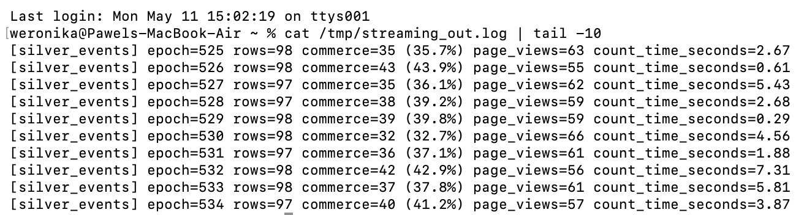
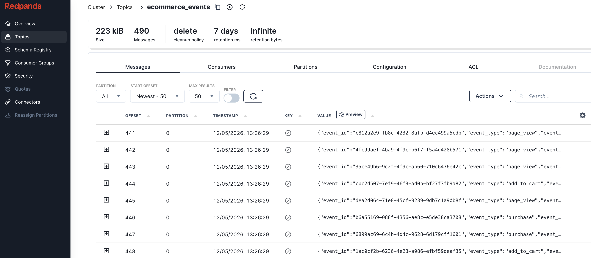
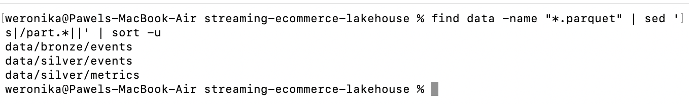

# Streaming E-commerce Lakehouse

Mini streaming data engineering project for e-commerce events using Kafka-compatible ingestion and Spark Structured Streaming.

## Goal

Build a near-real-time pipeline that handles:
- streaming ingestion
- late and out-of-order events
- checkpoint-based recovery
- lakehouse-style Bronze and Silver layers
- persisted Silver event output and streaming metrics

## Architecture

`Producer -> Redpanda (Kafka API) -> Spark Structured Streaming -> Bronze (Parquet) -> Silver (Parquet)`

## Tech Stack

- Python
- Redpanda (Kafka-compatible broker)
- PySpark Structured Streaming
- Parquet
- Local filesystem (MVP)
- GitHub Actions

## Project Structure

```text
src/producer/kafka_producer.py
src/streaming/stream_to_bronze_silver.py
src/schemas/event_schema.json
docker/docker-compose.yml
sql/silver_metrics.sql
```

## Data Layers

- Bronze: raw, append-only events with ingestion timestamp
- Silver events: cleaned, typed, filtered event stream persisted to Parquet
- Silver metrics: stateful windowed metrics persisted to Parquet

## Design Decisions and Trade-offs

**Micro-batch vs continuous streaming:** The pipeline uses micro-batch mode (`processingTime="10 seconds"`) rather than continuous processing. Micro-batch gives exactly-once semantics with checkpointing and is easier to reason about operationally — continuous mode adds latency savings that are not relevant at this event volume.

**Parquet instead of Delta Lake:** Delta would add schema enforcement and ACID transactions, but also a heavyweight dependency. For a Bronze/Silver MVP the goal is demonstrating the streaming logic, not the storage layer. A migration to Delta would be configuration-only.

**At-least-once with idempotent Silver filter:** Kafka source delivers at-least-once. Duplicates are tolerated at Bronze (append-only raw layer). Silver applies a deterministic quality filter, so reprocessing the same batch produces the same output.

**Separate observability query for Silver:** A dedicated `foreachBatch` sink logs row counts and processing time per micro-batch independently of the write path. This means observability does not add latency to the Silver write and can be changed or disabled without touching the data sink.

## What Makes It Production-Style

- checkpoint-backed recovery for Bronze and Silver streaming queries
- explicit handling of late and out-of-order events with watermarking
- persisted Silver event dataset in addition to streaming metrics
- unit tests for producer and Spark transformation logic
- CI workflow for linting and tests

## Pipeline in Action

Silver micro-batch observability log — row count, commerce share, and page views per epoch:



Redpanda Console — topic `ecommerce_events` with incoming messages:



Local lakehouse after pipeline run — Bronze and Silver layers written to Parquet:



## Real-World Streaming Scenarios

- Late-arriving events are simulated in the producer.
- Out-of-order event timestamps are included by design.
- Watermark is used to bound state and handle delayed events.
- Checkpointing enables recovery after failure/restart.

## Quick Start

1. Start Redpanda:

```bash
docker compose -f docker/docker-compose.yml up -d
```

2. Install dependencies:

```bash
pip install -r requirements.txt
```

3. Run producer:

```bash
python src/producer/kafka_producer.py
```

4. Run streaming job:

```bash
python src/streaming/stream_to_bronze_silver.py
```

## Local Quality Checks

Run locally:

```bash
python3 -m venv .venv
.venv/bin/python3 -m pip install -r requirements.txt -r requirements-dev.txt
make lint
make test
```

This validates:

- event generation shape and business assumptions
- Silver filtering logic for malformed commerce events
- Silver windowed metrics on a local Spark session
- local output path setup used by the streaming job

## Failure Recovery Check

1. Start streaming job and let data flow for 1-2 minutes.
2. Stop the streaming process.
3. Start it again with the same checkpoint location.
4. Confirm job resumes correctly and keeps processing new events.

## Expected Outputs

After the job runs, the local lakehouse should contain:

```text
data/bronze/events/
data/silver/events/
data/silver/metrics/
data/checkpoints/bronze_events/
data/checkpoints/silver_events/
data/checkpoints/silver_metrics/
```

This makes it possible to inspect both the cleaned Silver event stream and the aggregated metrics output.

## Possible Extensions

- Dashboard for Silver metrics (Grafana or similar).
- End-to-end integration test using Redpanda in Docker.
- Cloud deployment variant: Kinesis/MSK + S3 + Glue Streaming or EMR.
